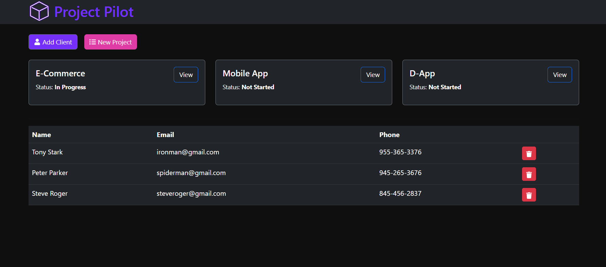

# Project Pilot - A Project Management Application

<p>Project Pilot is a project management application fo freelancers where you can manage all your ongoing and add clients to each projects.
You can perform all the CRUD operation in this application. This webapp is made using React.js, GraphQL and MongoDB.</p>

<h3>TechStack:</h3>

[](https://skillicons.dev)

<br/>

<br/>

# How to run the Project 🚀

1. Fork and Clone the Repo

```bash
      git clone "https://github.com/<username>/Project-Pilot.git"
```

2. Installing Node Modules

```bash
      cd server
      npm install

      cd client
      npm install
```

3. Create a new database in MongoDB.
4. Creating a `.env` file in server and add the following

```bash
      NODE_ENV = 'development'
      PORT = 5000
      MONGO_URI= ''
```

5. Now, you're ready to go! 🚀

```bash
      cd server
      npm run dev

      cd client
      npm start
```
